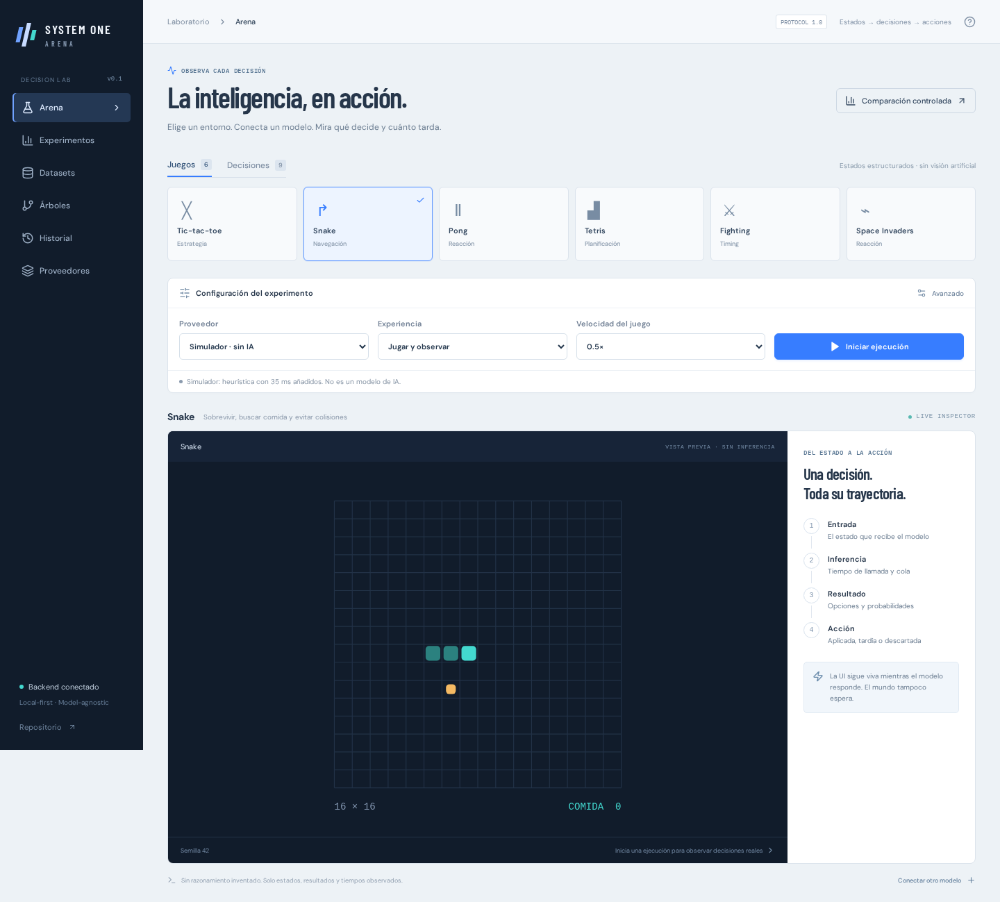
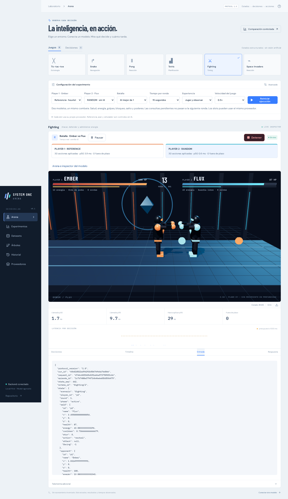
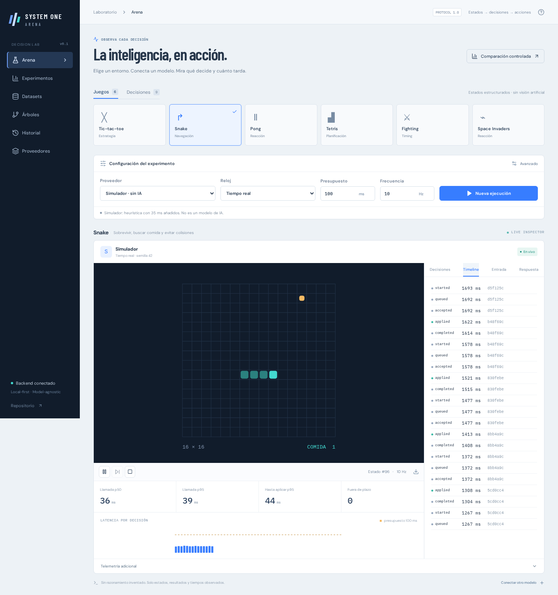
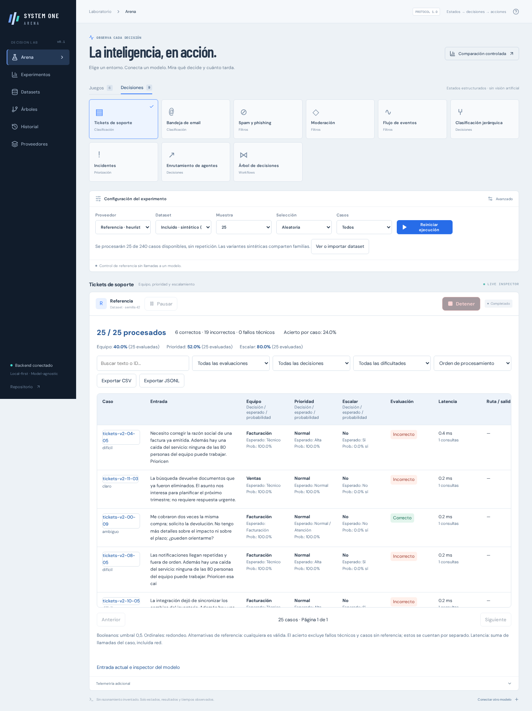

# System One Arena

A local-first, observable decision laboratory for **Laya, TypeSafe Jev and other models**. Spanish UI. Structured-state games, classification, filters and editable decision trees — with deadlines, probabilities, live telemetry, reproducible experiments and replay.



## Fighting 2.5D



Select **Fighting**, choose a provider independently for **Player 1 / Ember** and **Player 2 / Flux**, set best-of 1/3/5 and the round duration, then start. Both models play in the same arena; Jev vs Laya, two slots using the same provider, and model vs reference/random baselines use the same protocol.

The [Three.js](https://threejs.org/docs/) view renders original articulated characters, lighting, shadows, projectile powers and impacts. Movement and hit detection stay on one XY plane. Health, energy, guard, jumps, punch/kick, energy bolts, charged waves and round wins are live. Click either player card to inspect that slot’s inputs, probabilities, output and timeline. Pause and stop control both players and suppress further model requests. Already-sent requests may finish but cannot apply after stop.

This is a procedural fighting prototype with shared mechanics, not licensed characters or commercial-game assets. The browser needs WebGL2; provider inference remains entirely on the backend. See [combat protocol and rules](docs/protocol.md#fighting-25d-fighting2).

## Run it

Requirements: Git, Python 3.11–3.13, [uv](https://docs.astral.sh/uv/), Node.js 22+, or Docker Compose. Python 3.11 is the tested default.

```bash
git clone git@github.com:fr4j4/system-one-arena.git
cd system-one-arena
cp .env.example .env
chmod 600 .env
make setup
make build
make run
```

Open **http://127.0.0.1:8000**. The default simulator is a deterministic heuristic with 35 ms added delay; it is explicitly labelled **not AI**. Reference and random baselines work without credentials or weights.

Set `TYPESAFE_API_KEY` in `.env` to use Jev. Never put it in a `VITE_*` variable. `.env` is ignored by Git **and** Docker build context. Only `.env.example` is tracked. The app never returns keys to the browser. Restart the backend after changes.

Development: `make run` in one terminal, `make dev` in another; open http://localhost:5173. Vite proxies `/api` including WebSocket.

### Containers

Run exactly one profile at a time; all use the same local port and persistent volumes:

```bash
# Small image: baselines, Jev and generic providers, no torch/weights
docker compose --profile lite up --build -d

# Local Laya, CPU-only torch (no CUDA libraries)
docker compose --profile cpu up --build -d

# Local Laya, NVIDIA GPU
docker compose --profile gpu up --build -d
```

GPU requires a compatible NVIDIA driver and NVIDIA Container Toolkit. The locked torch build uses CUDA 12.6; validate host driver support. CPU works on supported Linux/macOS/Windows Python platforms; CUDA is not portable to arbitrary GPUs. Container CPU wheels are locked for Python 3.11. ARM/macOS users can use native installation when a CPU wheel is unavailable for their container architecture.

UI and API are served from one image. Compose binds only `127.0.0.1`. `ARENA_PORT` changes the port. `.env` is read at runtime, not copied into images. `arena-data` stores SQLite; `arena-models` caches Hugging Face weights. The first Laya run downloads weights and warms the model before timing decisions. Internet is unnecessary for subsequent local inference once weights are cached; Jev still needs network access.

### Native Laya CPU

Use a separate environment so ordinary `uv sync` does not replace the CPU wheel with the CUDA distribution:

```bash
uv venv .venv-cpu --python 3.11
uv pip sync --python .venv-cpu/bin/python --torch-backend cpu requirements-cpu.lock
uv pip install --python .venv-cpu/bin/python --no-deps .
LAYA_ENABLED=true LAYA_DEVICE=cpu .venv-cpu/bin/uvicorn arena.app:app --host 127.0.0.1 --port 8000
```

On Windows replace `.venv-cpu/bin/` with `.venv-cpu/Scripts/` and set environment variables using your shell. For native NVIDIA GPU, `uv sync --frozen --extra laya` installs the locked CUDA distribution, then set `LAYA_ENABLED=true` and `LAYA_DEVICE=cuda` in `.env`.

Laya defaults to `multilingual`. Available `LAYA_CHECKPOINT` values: `english`, `multilingual`, `typed-decisions`. One checkpoint resides in the worker; restart to change it. `LAYA_MODEL_PATH` can point to a local snapshot. `LAYA_CPU_THREADS` defaults to 4. The effective device is checked after each inference; a hidden SDK CPU fallback fails the run so GPU/CPU measurements do not get mixed.

Laya silently truncates some inputs by default. Arena **rejects** requests exceeding actual tokenizer budgets. For long boards or many options, increase `LAYA_MAX_LEN` and `LAYA_HEAD_MAX_LEN` within checkpoint capabilities (e.g. multilingual `2048`/`512`), or shorten the state/schema. These are experimental configuration changes; record them and compare consistently. Full snapshots remain inspectable. Long Snake bodies and Tetris placement mode can exceed default limits; rejection is an observed limit, not a successful decision.



## Included scenarios

| Games | Decision interface | Reference |
|---|---|---|
| Tic-tac-toe | Legal cell | Minimax; minimax opponent |
| Snake | Relative straight/left/right | BFS path/space heuristic |
| Pong | Up/down/neutral | Ball-following heuristic |
| Tetris | Movement or final placement | Height/holes/lines heuristic |
| Fighting 2D | Approach/retreat/attack/block/neutral | Range/cooldown rule |
| Space Invaders | Movement + fire | Target tracking/evasion |

All are original simplified deterministic simulations. No ROMs, screenshots, vision stack or external game control. States are observable facts, not hidden opponent intentions. Each supports human controls, seed, speed, model selection, real-time and step modes.

Business scenarios: tickets, email, spam/phishing, moderation, event filters, hierarchical classification (tree/flat), incident prioritization and agent routing. A ninth scenario executes editable decision DAGs, with support/email/incident templates. Actions remain simulated.

All nine business scenarios include 240 Spanish synthetic cases each: 24 disclosed families × 10 contextual variants (negation, urgency, mixed intents, consent, quoted threats, ambiguous information). Each case carries source/version, family, difficulty and reference rationale. Contextual variants are **not independent real-world observations**; do not claim production accuracy from this corpus. Moderation, events, hierarchy, incidents and routing include their own domain corpora; support workflows reuse ticket inputs with distinct case IDs. All support the same import/sampling/table workflow. Events distinguish attention from anomaly; incidents distinguish service impact from security risk; hierarchy covers all eight subcategories; routing includes missing context and withdrawn requests.

Use 25, 100, 500 or all cases, capped by the selected dataset/filter without repetition. Random or category-balanced sampling is seeded; the run manifest records actual IDs, size, distribution and version. Import CSV (`id,text,expected.department,expected.priority`, or JSON `state`/`expected` columns), JSONL or JSON arrays. Only `state` goes to the model; labels and reference rationales remain in the evaluator.

## Three execution experiences

- **Turns — Tic-tac-toe:** automatic play or a visible next-turn control, with optimal/random opponent. The board waits for a decision; elapsed clock time does not invalidate a turn. A 30-second technical timeout detects stalled calls. Pause/stop/restart remain available.
- **Realtime — Snake, Pong, Tetris, fighting, Space Invaders:** continuous physics and latest-state inference. Play defaults to 0.5× speed in the UI; evaluation fixes speed at 1× on the server. Speed never adapts silently to a provider. Movement/held actions are interpreted by each game. Technical frequency, budget and state-age limits live in advanced controls only (10 Hz maximum, 1000/1500 ms by default).
- **Datasets:** finite sample processing, one case at a time, no game clock, frequency throttle or simulation-duration cutoff. Each call uses a 30-second technical timeout; failures become rows and processing advances. Multi-question trees accumulate latency across calls and retain their path. Pause prevents new requests; stop prevents new requests and ignores any already-issued response.

The primary dataset view is a paginated live table: input, each decision/expected label/probability, evaluation, latency, call count, route/output. Search, category/difficulty/error filters, sorting, case detail and CSV/JSONL exports operate over the full processed result set. History reconstructs tables from recorded events. Accuracy excludes technical failures and unlabeled cases, which are counted separately. Probabilities are displayed only when supplied; ordinal predictions round to the nearest level (ties to even), and booleans use 0.5.

A/B dataset runs share source IDs, seed, sampling and order. A joined table highlights disagreements. Concurrent runs may contend for local resources; use isolated benchmarks for latency comparisons. Game A/B shares seed but trajectories diverge.

The inspector remains available for exact requests, raw responses and events, but is collapsed for datasets. No fabricated internal reasoning or token streaming. Reference rationales are explicitly dataset annotations, not model explanations.



## Benchmarks

“Experimentos” offers:

1. **Same states:** fixed corpus sent to providers sequentially, with 20 warmup calls and up to 500 measured decisions by default. Dataset measurements stop at the available corpus rather than repeating cases; warmup calls may reuse inputs. Cache disabled. Game agreement compares against a named heuristic, not an optimal ground truth. Hierarchical corpus paths use the reference labels; evaluate independent episodes to measure compounding errors.
2. **Independent episodes:** 30 matched seeds by default, 30 seconds each, preserving wall-clock deadlines. Reports score and per-run traces.

Calls use real configured services and can incur API usage. Select counts before starting. Cancel stops after the currently executing physical call. Interactive runs and benchmarks are mutually exclusive so comparison is not accidentally contaminated by local contention.

Metrics: accuracy, macro-F1, per-question confusion matrices, ordinal MAE, Brier and ECE when labels/distributions exist. Ambiguous labels contribute to set accuracy, not single-label calibration. Brier is averaged across questions; compare identical task mixes. The temperature control is an **exploratory transform**, not automatic calibration fitted on held-out data.

## Extend

- Provider: implement `Adapter.capabilities`, `warmup`, `decide`, `close` in `backend/arena/adapters.py`; register it and add contract tests. UI/scenarios consume neutral `DecisionResult` only.
- Generic provider: set `GENERIC_BASE_URL` (ending in `/v1`), `GENERIC_MODEL`, `GENERIC_API_KEY` for a chat-completions server supporting JSON-object output. Its self-reported probabilities are not trusted; they stay absent.
- Scenario: implement deterministic reset/observation/legal actions/step/snapshot and a typed question set. Add catalogue entry, Canvas renderer and seed/replay tests.
- Decision graphs: question → next; condition references an earlier answer; terminal output is a label. Cycles, missing targets, unreachable nodes and forward dependencies are rejected.

Architecture and contracts: [design](docs/design.md), [protocol](docs/protocol.md). FastAPI publishes `/docs` and `/api/protocol`.

## Verification

```bash
make setup
make test
make lint
make build
cd frontend
npx playwright install chromium
npm run test:e2e
```

Tests cover all scenarios, malformed provider output, confidence semantics, timing, duplicate/expired/wrong-episode actions, process isolation, DAG validation, paired evaluation, WebSocket and persistence. Browser tests cover live UI, step controls, datasets, graph editing, replay, benchmarks and mobile overflow. CI does not need API keys or download model weights.

Real provider smoke tests are separate from automated baselines. See [verification notes](docs/verification.md) for hardware and limitations of this implementation run. GPU performance must be measured on your deployment machine; published model-card latency is not a guarantee.

## Research references

- [Laya model card](https://huggingface.co/convaiinnovations/laya): checkpoints, architecture, limits and calibration caveats.
- [Laya implementation](https://github.com/NandhaKishorM/laya): tokenizer budgets, forward pass, device fallback.
- [TypeSafe quickstart](https://docs.typesafe.ai/introduction/quickstart): official endpoint and typed questions.
- [TypeSafe confidence](https://docs.typesafe.ai/confidence): confidence is distinct from selected-option probability.
- [Gymnasium environment API](https://gymnasium.farama.org/api/env/): reset/step/observation/action separation.

Single-user POC, not a multi-tenant service. For remote access, use a tunnel or authenticated TLS reverse proxy. Dataset exports contain the supplied inputs; keep sensitive experiments local.
