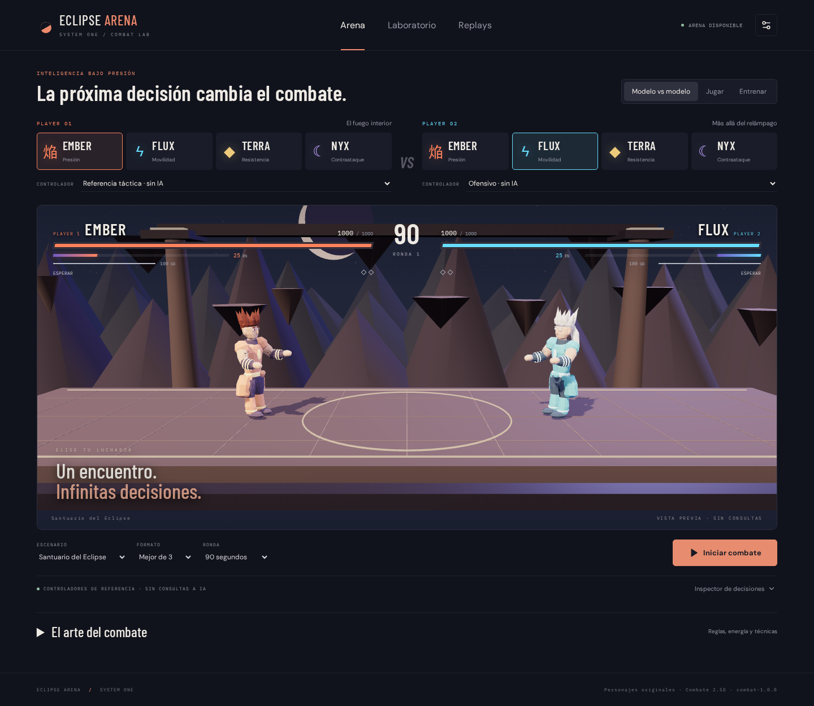

# System One · Eclipse Arena

Arena local de combate 2.5D para enfrentar **Jev, Laya, modelos compatibles y jugadores humanos**. Dos personajes 3D comparten un plano de movimiento y un motor autoritativo; cada slot elige su propio personaje y perfil de modelo.



## Iniciar

Python 3.11–3.13, Node.js 22+ y `uv`.

```bash
cp .env.example .env
chmod 600 .env
make setup
make build
make run
```

Abre **http://127.0.0.1:8000**. Desde otra máquina de la red local usa la IP (`http://192.168.x.y:5173` con `npm run dev`, o el puerto de uvicorn con `--host 0.0.0.0`); los nombres de host distintos de `localhost` (p. ej. `mi-mac.local`) se rechazan con 403 salvo que los añadas a `ARENA_ALLOWED_HOSTS=mi-mac.local,otro` en `.env`. Los controladores de referencia funcionan sin credenciales y están identificados como **sin IA**. Selecciona **Jev** en uno o ambos slots para usar el proveedor real. La vista precarga los personajes antes de habilitar el combate.

- **Arena:** modelo/modelo, humano/modelo o humano/referencia; mejor de 1, 3 o 5, rondas de 30–120 s.
- **Entrenar:** distancia de combo, defensa, aire, esquina, energía máxima, choque de rayos y remates. Reinicio y avance de un frame en pausa.
- **Laboratorio:** series emparejadas que intercambian lados y personajes; tabla de daño, energía gastada, parries, choques, latencia y exportación.
- **Replays:** reproducción, velocidad, búsqueda temporal y marcadores; usa los estados grabados, sin consultas a modelos.

**Pausar** congela el mundo y suspende consultas nuevas. **Detener** finaliza el encuentro. Una solicitud enviada puede terminar físicamente, pero su respuesta no se aplica después de pausar/detener. Perder el foco o desconectar el navegador de un jugador humano pausa la partida. No hay sustitución automática por un bot si falla un modelo.

## Proveedores y secretos

Configura `TYPESAFE_API_KEY` en `.env` para Jev. No uses variables `VITE_*` para secretos. `.env` y `providers.local.json` están excluidos de Git y del contexto Docker.

Cada perfil especifica proveedor, modelo/checkpoint, endpoint y **nombre** de una variable de credenciales. Copia `providers.example.json` a `providers.local.json` para añadir dos modelos del mismo proveedor sin cambiar variables globales. Reinicia el backend tras editar perfiles. El navegador nunca recibe credenciales.

Para Laya:

```bash
uv sync --frozen --extra dev --extra laya
# .env: LAYA_ENABLED=true, LAYA_DEVICE=cpu o cuda
make run
```

Los pesos se cargan en un proceso independiente y se reutilizan; el tokenizer valida las observaciones antes de comenzar. El modo nativo usa **800 ms por decisión**, con una consulta física pendiente por slot. **Laya en la CPU del entorno de verificación excedió ese plazo**: el adaptador funciona, pero para combatir con este ritmo necesita una GPU suficientemente rápida. La app muestra el fallo de latencia y pausa; no oculta el problema con acciones de referencia. `scripts/check_combat_match.py laya` permite diagnosticar CPU con 5000 ms explícitos, separados de las mediciones nativas.

Los endpoints compatibles con Chat Completions deben aceptar salida JSON. El modelo recibe únicamente estado táctico público y acciones tipadas. Ver [protocolo](docs/protocol.md), [reglas](docs/combat/RULES.md) y [verificación](docs/verification.md).

## Jugar

Teclado predeterminado: A/D retroceder/avanzar; espacio saltar; J/K ligero/fuerte; L guardia alta; S+L guardia baja; H cargar; U proyectil; I rayo; O técnica; P definitiva; Shift dash; F evasión; G agarre; N barrido; M overhead; B lanzador; R escape; 1–4 rutas de combo; Escape pausa. A/D + espacio salta con desplazamiento. Durante un choque: J sostener, K impulsar, O sobrecargar, A ceder. Tras KO: J remate, K perdonar.

Mando estándar: stick movimiento; A salto; X/Y ligero/fuerte; B técnica; LB dash; RB rayo; LT guardia; RT carga; View escape; Start pausa; L3 definitiva; R3 combo de poder. Teclas y botones reasignables en Ajustes, junto con sonido, calidad gráfica, reducción de destellos y movimiento.

Los cuatro luchadores tienen técnicas propias: Ember encadena fuego, Flux avanza con velocidad, Terra absorbe un golpe y Nyx contraataca. Los remates son cinematográficos y sin gore. Personajes, animaciones, escenarios y audio originales; [procedencia de recursos](docs/combat/ASSETS.md).

## Arquitectura y desarrollo

- Motor puro a 60 ticks/s en proceso separado; snapshots a 30 Hz; Three.js interpola y anima sin decidir impactos.
- FastAPI coordina sesiones, perfiles, llamadas, WebSocket y persistencia SQLite con escritor asíncrono.
- Nuevos datos en `data/combat-v2`; no modifica la base de datos de la versión anterior.
- El renderer necesita WebGL2. Móvil permite configurar y observar; el combate humano requiere teclado o mando. No hay multijugador remoto.

```bash
make test
make lint
make build
cd frontend && npx playwright install chromium && npm run test:e2e
```

E2E levanta un servidor independiente en el puerto 8013. `scripts/build_fighters.py` reconstruye los GLB originales. `scripts/combat_soak.py` ejecuta una prueba de 30 minutos sin proveedores de pago. Las comprobaciones reales de proveedor son explícitas: `scripts/check_combat_provider.py jev` y `scripts/check_combat_match.py jev`.

Desarrollo: `make run` y `make dev` en terminales separadas. Vite sirve el frontend en 5173 y proxifica `/api`. Docker: `docker compose --profile lite up --build -d`, o perfiles `cpu`/`gpu` para Laya. Ejecuta un solo perfil a la vez. Los contenedores conservan los datos en un volumen y no incluyen credenciales en la imagen.

## Versión anterior

La arena de juegos, clasificación, datasets y árboles de decisión está preservada íntegramente en **`legacy`** y el tag **`arena-legacy-v1`**. Para usarla sin alterar esta app:

```bash
git worktree add ../system-one-arena-legacy legacy
```

Su documentación y pruebas viven en esa rama. No copies `.env` a un commit.
